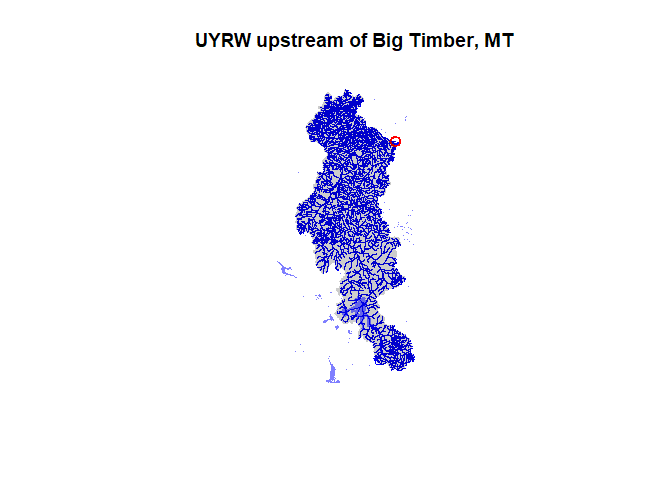

MITACS UYRW project
A basic example script for working with watershed data in R.
This simply follows the example on the nhdplusTools github page with some minor modifications


```r
# install and load the NHDPlus Tools package for fetching data, and load sf for GIS
install.packages('nhdplusTools')
```

```
## package 'nhdplusTools' successfully unpacked and MD5 sums checked
## 
## The downloaded binary packages are in
## 	C:\Users\deank\AppData\Local\Temp\RtmpyaAx4g\downloaded_packages
```

```r
library(nhdplusTools)
```

```
## USGS Support Package: https://owi.usgs.gov/R/packages.html#support
```

```r
library(sf)
```

```
## Linking to GEOS 3.8.0, GDAL 3.0.4, PROJ 6.3.1
```

```r
# install the AOI and HydroData packages from github using devtools
library(devtools)
```

```
## Loading required package: usethis
```

```r
install_github('mikejohnson51/HydroData')
```

```
## Skipping install of 'HydroData' from a github remote, the SHA1 (6b7f0865) has not changed since last install.
##   Use `force = TRUE` to force installation
```

```r
library(HydroData)
```

```
## Loading required package: AOI
```

```
## Loading required package: leaflet
```

```r
# hydrodata has TONS of good links to data sources, incl sensor gages

# define an origin point from which to explore outward
YellowstoneLake.pt = geocode(location='Yellowstone Lake', pt=TRUE)

# define a source outlet from which to explore upstream 
BigTimber.pt = geocode(location='Big Timber', pt=TRUE)

# AOI package (loaded by HydroData) has a nice interactive map feature
aoi_map(BigTimber.pt)
```

```
## Simple feature collection with 1 feature and 1 field
## geometry type:  POINT
## dimension:      XY
## bbox:           xmin: -109.9553 ymin: 45.8349 xmax: -109.9553 ymax: 45.8349
## geographic CRS: NAD83
##      request                  geometry
## 1 Big Timber POINT (-109.9553 45.8349)
```

```r
# get a COMID for the source outlet
BigTimber.comid = discover_nhdplus_id(BigTimber.pt)

# download a line geometry defining flowlines upstream of Big Timber, MT
BigTimber.flowlines = navigate_nldi(list(featureSource='comid', featureID=BigTimber.comid), mode='upstreamTributaries', data_source = '')

# notice that we now have a huge number of COMIDs for the watershed upstream of Big Timber
print(BigTimber.flowlines$nhdplus_comid)
```

```
##    [1] "4367242"   "4366552"   "4366554"   "4366602"   "4367234"   "4366616"   "4367238"   "4366630"   "4366628"   "4367232"   "4366632"   "4366018"  
##   [13] "4366646"   "4365532"   "4366004"   "4366654"   "4366644"   "4365538"   "4365534"   "4366002"   "4366672"   "4366658"   "4364014"   "4365540"  
##   [25] "4365536"   "4363966"   "4366692"   "4366670"   "4366656"   "4364036"   "4365542"   "4365544"   "4363996"   "4366702"   "4364070"   "4364016"  
##   [37] "4365550"   "4365546"   "4363978"   "4363976"   "4366714"   "4365556"   "4365552"   "4365548"   "4363970"   "4363968"   "4363826"   "4363824"  
##   [49] "4366712"   "4367180"   "4375992"   "4365558"   "4364030"   "4364058"   "4363934"   "4363936"   "4363814"   "4363820"   "4366686"   "4366732"  
##   [61] "4366722"   "4365554"   "4365562"   "4365560"   "4364020"   "4364108"   "4363920"   "4363922"   "4363804"   "4363808"   "4365404"   "4365410"  
##   [73] "4366736"   "4367178"   "4366730"   "4366728"   "4364068"   "4365564"   "4365566"   "4364082"   "4363984"   "4363876"   "4363874"   "4363810"  
##   [85] "4366738"   "4366742"   "4366756"   "4366734"   "4364044"   "4364098"   "4365572"   "4365568"   "4364056"   "4366720"   "4367182"   "4366748"  
##   [97] "4366744"   "4375954"   "4365440"   "4365858"   "4365578"   "4365570"   "4364050"   "4364048"   "4364156"   "4364236"   "4364190"   "4366760"  
##  [109] "4364200"   "4364168"   "4365856"   "4365584"   "4365582"   "4364102"   "4364004"   "4364194"   "4365854"   "4364298"   "4366772"   "4366808"  
##  [121] "4365442"   "4365850"   "4365940"   "4364106"   "4365574"   "4364308"   "4365852"   "4365894"   "4364100"   "4365580"   "4365576"   "4364332"  
##  [133] "4364370"   "4364300"   "4366786"   "4364088"   "4365848"   "4365586"   "4364376"   "4364334"   "4364432"   "4364316"   "4364318"   "4366820"  
##  [145] "4366814"   "4364090"   "4365846"   "4365588"   "4365592"   "4364442"   "4364466"   "4364460"   "4364416"   "4364384"   "4364060"   "4364128"  
##  [157] "4365444"   "4365590"   "4365594"   "4365606"   "4364444"   "4364548"   "4364540"   "4364474"   "4364430"   "4365446"   "4364130"   "4364138"  
##  [169] "4365602"   "4365600"   "4364446"   "4364580"   "4364600"   "4364544"   "4364232"   "4364196"   "4365448"   "4364122"   "4365604"   "4365624"  
##  [181] "4364178"   "4364478"   "4364440"   "4364626"   "4364658"   "4364304"   "4364262"   "4364120"   "4364136"   "4364152"   "4365656"   "4365626"  
##  [193] "4364258"   "4364288"   "4364510"   "4364588"   "4364434"   "4364436"   "4364382"   "4364356"   "4364336"   "4364114"   "4365432"   "4364150"  
##  [205] "4365664"   "4365966"   "4365968"   "4364344"   "4364276"   "4364542"   "4364536"   "4364680"   "4364592"   "4364418"   "4364410"   "4364366"  
##  [217] "4364396"   "4364354"   "4364112"   "4365452"   "4364148"   "4365962"   "4365678"   "4364166"   "4364420"   "4364408"   "4364488"   "4364464"  
##  [229] "4364614"   "4364558"   "4364752"   "4364682"   "4364590"   "4364346"   "4364348"   "4364080"   "4364078"   "4365434"   "4365438"   "4365468"  
##  [241] "4364244"   "4365698"   "4365680"   "4365470"   "4364428"   "4364462"   "4364574"   "4364606"   "4364796"   "4364724"   "4364650"   "4364320"  
##  [253] "4364074"   "4364076"   "4364066"   "4364116"   "4364134"   "4364144"   "4365700"   "4365708"   "4364238"   "4364572"   "4364662"   "4364608"  
##  [265] "4364808"   "4364810"   "4364742"   "4364740"   "4364668"   "4364708"   "4364032"   "4364072"   "4364064"   "4365454"   "4364142"   "4364264"  
##  [277] "4365724"   "4364686"   "4364672"   "4364820"   "4364826"   "4364806"   "4364770"   "4364798"   "4364792"   "4364670"   "4364704"   "4364758"  
##  [289] "4364022"   "4364024"   "4364042"   "4364040"   "4364154"   "4364140"   "4365710"   "4365742"   "4365726"   "4364696"   "4364726"   "4364816"  
##  [301] "4364834"   "4364854"   "4364790"   "4364782"   "4364748"   "4363994"   "4363998"   "4364038"   "4365430"   "4364008"   "4364006"   "4365740"  
##  [313] "4365746"   "4365476"   "4364876"   "4365502"   "4365500"   "4364840"   "4364958"   "4364874"   "4364852"   "4364944"   "4363992"   "4363990"  
##  [325] "4365426"   "4365428"   "4365424"   "4365422"   "4365744"   "4365738"   "4365748"   "4364924"   "4364886"   "4364744"   "4364712"   "4364962"  
##  [337] "4364950"   "4364914"   "4364858"   "4364954"   "4363972"   "4363974"   "4364012"   "4364010"   "4364084"   "4364028"   "4363952"   "4363950"  
##  [349] "4364362"   "4365728"   "4376000"   "4364380"   "4365008"   "4365036"   "4365042"   "4364966"   "4365034"   "4365062"   "4364990"   "4363960"  
##  [361] "4363962"   "4364002"   "4364000"   "4364026"   "4364018"   "4363912"   "4363908"   "4363910"   "4364438"   "4365730"   "4365732"   "4365722"  
##  [373] "4365480"   "4364502"   "4365080"   "4365012"   "4365082"   "4365110"   "4365076"   "4365070"   "4365024"   "4364974"   "4364994"   "4365040"  
##  [385] "4363954"   "4363956"   "4363946"   "4363948"   "4363986"   "4363988"   "4364104"   "4364086"   "4365984"   "4364364"   "4364328"   "4364452"  
##  [397] "4364522"   "4364640"   "4364552"   "4365120"   "4365074"   "4365156"   "4365088"   "4365084"   "4365124"   "4365186"   "4365086"   "4365078"  
##  [409] "4365212"   "4364972"   "4364980"   "4364992"   "4365046"   "4365048"   "4363896"   "4363898"   "4363940"   "4363938"   "4363982"   "4363980"  
##  [421] "4365720"   "4365718"   "4365982"   "4364482"   "4364486"   "4364630"   "4364656"   "4365116"   "4365198"   "4365204"   "4365072"   "4365214"  
##  [433] "4365990"   "4365250"   "4365248"   "4365146"   "4365112"   "4365044"   "4364988"   "4365136"   "4363852"   "4363854"   "4363930"   "4363928"  
##  [445] "4363958"   "4363964"   "4363924"   "4363926"   "4365994"   "4365714"   "4365712"   "4364526"   "4364516"   "4365244"   "4365060"   "4365058"  
##  [457] "4365252"   "4365216"   "4365992"   "4369848"   "4367878"   "4365166"   "4365238"   "4365232"   "4365122"   "4365026"   "4364986"   "4365242"  
##  [469] "4365522"   "4363846"   "4365420"   "4365416"   "4363942"   "4363944"   "4363914"   "4363916"   "4363812"   "4364506"   "4365716"   "4365976"  
##  [481] "4365974"   "4367906"   "4365834"   "4367854"   "4367896"   "4367988"   "4365234"   "4367894"   "4369850"   "4365202"   "4365188"   "4365068"  
##  [493] "4367844"   "4363866"   "4363864"   "4363842"   "4363840"   "4363890"   "4363892"   "4364512"   "4365692"   "4365690"   "4364296"   "4367912"  
##  [505] "4367910"   "4365836"   "4367900"   "4367990"   "4368038"   "4367852"   "4367914"   "4365228"   "4365230"   "4365196"   "4365180"   "4365148"  
##  [517] "4367880"   "4367892"   "4363860"   "4363862"   "4363830"   "4363832"   "4364628"   "4364554"   "4364338"   "4365682"   "4365676"   "4368024"  
##  [529] "4367954"   "4369784"   "4365246"   "4368056"   "4368090"   "4369854"   "4369852"   "4365200"   "4365208"   "4369346"   "4369344"   "4369354"  
##  [541] "4367960"   "4364652"   "4364638"   "4364556"   "4364484"   "4364322"   "4365952"   "4365950"   "4369786"   "4367904"   "4368058"   "4368072"  
##  [553] "4369524"   "4367956"   "4367932"   "4365182"   "4365226"   "4365224"   "4367968"   "4368010"   "4367974"   "4367996"   "4364674"   "4364560"  
##  [565] "4364632"   "4364324"   "4365958"   "4365956"   "4365948"   "4368074"   "4367970"   "4369508"   "4368104"   "4368120"   "4369518"   "4369856"  
##  [577] "4369858"   "4368028"   "4368012"   "4369846"   "4369356"   "4364678"   "4364422"   "4365960"   "4364246"   "4365996"   "4369510"   "4368186"  
##  [589] "4368144"   "4368178"   "4368140"   "4368082"   "4367902"   "4367864"   "4369792"   "4368018"   "4369878"   "4368136"   "4368160"   "4368168"  
##  [601] "4365954"   "4365670"   "4364210"   "4364208"   "4364216"   "4368062"   "4368266"   "4368210"   "4368132"   "4368192"   "4368146"   "4367924"  
##  [613] "4367998"   "4367874"   "4367958"   "4369788"   "4368054"   "4368150"   "4369362"   "4369796"   "4369798"   "4364254"   "4365668"   "4365666"  
##  [625] "4365636"   "4364204"   "4365456"   "4364184"   "4368212"   "4368242"   "4369794"   "4368202"   "4368196"   "4368190"   "4368182"   "4367994"  
##  [637] "4367966"   "4368188"   "4368172"   "4369804"   "4365474"   "4365642"   "4365640"   "4365638"   "4365632"   "4364146"   "4365458"   "4368264"  
##  [649] "4368278"   "4368286"   "4368204"   "4368256"   "4369526"   "4368052"   "4368044"   "4368234"   "4368216"   "4365658"   "4364228"   "4365634"  
##  [661] "4368296"   "4368272"   "4368294"   "4368324"   "4369810"   "4368218"   "4368208"   "4368282"   "4368008"   "4368078"   "4368174"   "4368252"  
##  [673] "4368248"   "4365972"   "4365970"   "4365844"   "4365886"   "4365628"   "4368284"   "4368274"   "4368356"   "4368332"   "4369564"   "4369802"  
##  [685] "4368076"   "4368086"   "4368306"   "4368184"   "4368254"   "4375920"   "4365618"   "4364234"   "4376008"   "4365620"   "4369800"   "4369566"  
##  [697] "4368198"   "4368180"   "4368268"   "4368280"   "4369876"   "4368288"   "4364192"   "4364224"   "4364274"   "4365630"   "4365884"   "4365616"  
##  [709] "4365614"   "4368318"   "4368372"   "4369370"   "4368374"   "4365598"   "4364340"   "4364202"   "4364468"   "4364230"   "4364198"   "4375994"  
##  [721] "4365596"   "4369572"   "4368298"   "4368406"   "4368430"   "4369374"   "4365980"   "4364520"   "4365622"   "4366006"   "4366008"   "4368344"  
##  [733] "4368308"   "4368366"   "4368460"   "4368458"   "4368376"   "4369372"   "4365978"   "4364644"   "4364584"   "4375816"   "4368330"   "4368310"  
##  [745] "4368386"   "4368468"   "4368570"   "4368456"   "4368548"   "4369824"   "4369822"   "4365878"   "4364720"   "4364690"   "4364688"   "4364582"  
##  [757] "4368346"   "4368378"   "4368480"   "4368592"   "4368584"   "4368620"   "4064316"   "4365608"   "4364760"   "4364722"   "4364714"   "4364768"  
##  [769] "4364642"   "4369814"   "4368484"   "4369388"   "4368636"   "4368602"   "4368718"   "4368720"   "4064066"   "4365612"   "4365610"   "4364824"  
##  [781] "4364754"   "4364784"   "4364766"   "4369382"   "4369386"   "4368634"   "4368664"   "4368704"   "4368692"   "4369830"   "4064064"   "4064062"  
##  [793] "4365922"   "4365916"   "4364268"   "4364838"   "4364828"   "4364870"   "4364842"   "4364856"   "4364812"   "4364728"   "4364730"   "4368524"  
##  [805] "4368522"   "4368644"   "4368712"   "4369398"   "4368746"   "4369828"   "4064060"   "4064258"   "4365646"   "4365914"   "4364934"   "4364946"  
##  [817] "4364830"   "4364902"   "4364906"   "4364864"   "4364866"   "4364868"   "4368518"   "4368578"   "4368660"   "4368740"   "4368758"   "4369402"  
##  [829] "4064058"   "4064278"   "4365876"   "4365918"   "4365906"   "4364976"   "4364920"   "4368520"   "4368510"   "4368726"   "4368668"   "4368658"  
##  [841] "4368778"   "4368768"   "4368810"   "4368884"   "4064314"   "4064312"   "4365660"   "4365904"   "4365920"   "4364280"   "4364952"   "4364942"  
##  [853] "4368500"   "4368498"   "4368670"   "4368678"   "4368802"   "4368776"   "4368804"   "4368826"   "4368886"   "4369422"   "4064262"   "4064264"  
##  [865] "4064274"   "4365662"   "4365672"   "4364282"   "4376010"   "4365908"   "4368496"   "4368494"   "4368706"   "4368734"   "4368818"   "4368860"  
##  [877] "4369696"   "4368848"   "4369450"   "4368876"   "4368912"   "4064044"   "4064046"   "4064276"   "4364330"   "4375844"   "940070084" "4364290"  
##  [889] "4364292"   "4375828"   "4368478"   "4368508"   "4368798"   "4368784"   "4368846"   "4368824"   "4369698"   "4369420"   "4368878"   "4368962"  
##  [901] "4368968"   "4369832"   "4064040"   "4064036"   "4064038"   "4364286"   "4376018"   "940070082" "940070083" "4365902"   "4365900"   "4365644"  
##  [913] "4369640"   "4369718"   "4369700"   "4368936"   "4368966"   "4368978"   "4369022"   "4064034"   "4364158"   "4364186"   "4365674"   "4365938"  
##  [925] "4364406"   "4365686"   "4375846"   "4364302"   "4369638"   "4368840"   "4368736"   "4368938"   "4369418"   "4368992"   "4369014"   "4064020"  
##  [937] "4064254"   "4364160"   "4364424"   "4364404"   "4364414"   "4365694"   "4365688"   "4365696"   "4364306"   "4364310"   "4368400"   "4369722"  
##  [949] "4369016"   "4368942"   "4369838"   "4369458"   "4369460"   "4369062"   "4369086"   "4064014"   "4064252"   "4064018"   "4064030"   "4365702"  
##  [961] "4365936"   "4375998"   "4364412"   "4365704"   "4365648"   "4365654"   "4368384"   "4368392"   "4369724"   "4369052"   "4369042"   "4368946"  
##  [973] "4369416"   "4064006"   "4063980"   "4064266"   "4064028"   "4364426"   "4364400"   "4365734"   "4365652"   "4376006"   "4369818"   "4369820"  
##  [985] "4368854"   "4369056"   "4369088"   "4369060"   "4369044"   "4368950"   "4368964"   "4369834"   "4064004"   "4064248"   "4063978"   "4064052"  
##  [997] "4064048"   "4064016"   "4365706"   "4364402"  
##  [ reached getOption("max.print") -- omitted 3340 entries ]
```

```r
# download geometries defining catchements, water bodies, and the full flowline network
BigTimber.nhdfile = tempfile(fileext = '.gpkg')
subset_nhdplus(comids=BigTimber.flowlines$nhdplus_comid, output_file=BigTimber.nhdfile, nhdplus_data='download')
```

```
## All intersections performed in latitude/longitude.
```

```
## Reading NHDFlowline_Network
```

```
## Warning in get_flowline_subset(nhdplus_data, comids, output_file, paths$fline_path, : Download functionality not tested for this many comids
```

```
## Writing NHDFlowline_Network
```

```
## Reading CatchmentSP
```

```
## Writing CatchmentSP
```

```
## $NHDFlowline_Network
## Simple feature collection with 4340 features and 139 fields
## geometry type:  MULTILINESTRING
## dimension:      XYZ
## bbox:           xmin: -111.1124 ymin: 43.9498 xmax: -109.728 ymax: 46.2633
## z_range:        zmin: 0 zmax: 0
## geographic CRS: WGS 84
## # A tibble: 4,340 x 140
##    id     comid fdate               resolution gnis_id gnis_name lengthkm reachcode flowdir wbareacomi ftype fcode shape_length streamleve streamorde
##    <chr>  <int> <dttm>              <chr>      <chr>   <chr>        <dbl> <chr>     <chr>        <int> <chr> <int>        <dbl>      <int>      <int>
##  1 nhdf~ 2.96e6 1999-07-19 22:00:00 Medium     "78278~ "East Br~    4.75  10070001~ With D~          0 Stre~ 46006      0.0550           5          1
##  2 nhdf~ 2.96e6 1999-07-19 22:00:00 Medium     " "     " "          2.36  10070001~ With D~          0 Stre~ 46006      0.0266           5          1
##  3 nhdf~ 2.96e6 1999-07-19 22:00:00 Medium     "80093~ "Hellroa~    1.02  10070001~ With D~          0 Stre~ 46006      0.00975          4          2
##  4 nhdf~ 2.96e6 1999-07-19 22:00:00 Medium     "80147~ "Slough ~    3.67  10070001~ With D~          0 Stre~ 46006      0.0409           5          1
##  5 nhdf~ 2.96e6 1999-07-19 22:00:00 Medium     " "     " "          3.06  10070001~ With D~          0 Stre~ 46006      0.0380           6          1
##  6 nhdf~ 2.96e6 1999-07-19 22:00:00 Medium     "78727~ "Middle ~    2.11  10070001~ With D~          0 Stre~ 46006      0.0198           5          1
##  7 nhdf~ 2.96e6 1999-07-19 22:00:00 Medium     "78141~ "Clover ~    2.56  10070001~ With D~          0 Stre~ 46006      0.0292           5          1
##  8 nhdf~ 2.96e6 1999-07-19 22:00:00 Medium     " "     " "          0.673 10070001~ With D~          0 Stre~ 46006      0.00661          7          1
##  9 nhdf~ 2.96e6 1999-07-19 22:00:00 Medium     " "     " "          2.48  10070001~ With D~          0 Stre~ 46006      0.0292           6          1
## 10 nhdf~ 2.96e6 1999-07-19 22:00:00 Medium     "79050~ "Silver ~    4.36  10070001~ With D~          0 Stre~ 46006      0.0439           6          1
## # ... with 4,330 more rows, and 125 more variables: streamcalc <int>, fromnode <dbl>, tonode <dbl>, hydroseq <dbl>, levelpathi <dbl>, pathlength <dbl>,
## #   terminalpa <dbl>, arbolatesu <dbl>, divergence <int>, startflag <int>, terminalfl <int>, dnlevel <int>, uplevelpat <dbl>, uphydroseq <dbl>,
## #   dnlevelpat <dbl>, dnminorhyd <dbl>, dndraincou <int>, dnhydroseq <dbl>, frommeas <dbl>, tomeas <dbl>, rtndiv <int>, vpuin <int>, vpuout <int>,
## #   areasqkm <dbl>, totdasqkm <dbl>, divdasqkm <dbl>, tidal <int>, totma <dbl>, wbareatype <chr>, pathtimema <dbl>, hwnodesqkm <dbl>, maxelevraw <int>,
## #   minelevraw <int>, maxelevsmo <int>, minelevsmo <int>, slope <dbl>, elevfixed <chr>, hwtype <chr>, slopelenkm <dbl>, qa_ma <dbl>, va_ma <dbl>,
## #   qc_ma <dbl>, vc_ma <dbl>, qe_ma <dbl>, ve_ma <dbl>, qa_01 <dbl>, va_01 <dbl>, qc_01 <dbl>, vc_01 <dbl>, qe_01 <dbl>, ve_01 <dbl>, qa_02 <dbl>,
## #   va_02 <dbl>, qc_02 <dbl>, vc_02 <dbl>, qe_02 <dbl>, ve_02 <dbl>, qa_03 <dbl>, va_03 <dbl>, qc_03 <dbl>, vc_03 <dbl>, qe_03 <dbl>, ve_03 <dbl>,
## #   qa_04 <dbl>, va_04 <dbl>, qc_04 <dbl>, vc_04 <dbl>, qe_04 <dbl>, ve_04 <dbl>, qa_05 <dbl>, va_05 <dbl>, qc_05 <dbl>, vc_05 <dbl>, qe_05 <dbl>,
## #   ve_05 <dbl>, qa_06 <dbl>, va_06 <dbl>, qc_06 <dbl>, vc_06 <dbl>, qe_06 <dbl>, ve_06 <dbl>, qa_07 <dbl>, va_07 <dbl>, qc_07 <dbl>, vc_07 <dbl>,
## #   qe_07 <dbl>, ve_07 <dbl>, qa_08 <dbl>, va_08 <dbl>, qc_08 <dbl>, vc_08 <dbl>, qe_08 <dbl>, ve_08 <dbl>, qa_09 <dbl>, va_09 <dbl>, qc_09 <dbl>,
## #   vc_09 <dbl>, qe_09 <dbl>, ve_09 <dbl>, qa_10 <dbl>, ...
## 
## $CatchmentSP
## Simple feature collection with 4162 features and 8 fields
## geometry type:  MULTIPOLYGON
## dimension:      XY
## bbox:           xmin: -111.1212 ymin: 43.9458 xmax: -109.7225 ymax: 46.2722
## geographic CRS: WGS 84
## # A tibble: 4,162 x 9
##    id             gridcode featureid sourcefc   areasqkm shape_length shape_area bbox                                                           geometry
##    <chr>             <int>     <int> <chr>         <dbl>        <dbl>      <dbl> <list>                                               <MULTIPOLYGON [°]>
##  1 catchmentsp.1~   591564   2962262 NHDFlowli~     9.93       0.158    0.00114  <dbl [~ (((-110.323 45.201, -110.3234 45.2009, -110.3236 45.2011, -110~
##  2 catchmentsp.1~   590463   2962264 NHDFlowli~     4.13       0.0994   0.000473 <dbl [~ (((-110.3438 45.1845, -110.344 45.1847, -110.3453 45.1853, -11~
##  3 catchmentsp.1~   590838   2962266 NHDFlowli~     1.66       0.0706   0.000190 <dbl [~ (((-110.3647 45.1938, -110.3666 45.1942, -110.3687 45.1951, -1~
##  4 catchmentsp.1~   590949   2962268 NHDFlowli~     5.85       0.127    0.000670 <dbl [~ (((-110.145 45.191, -110.1453 45.1917, -110.146 45.1927, -110.~
##  5 catchmentsp.1~   590661   2962270 NHDFlowli~     3.85       0.107    0.000441 <dbl [~ (((-110.1401 45.1806, -110.1405 45.1814, -110.1417 45.183, -11~
##  6 catchmentsp.1~   589623   2962272 NHDFlowli~     4.28       0.0930   0.000490 <dbl [~ (((-110.3057 45.1818, -110.306 45.1822, -110.3074 45.1831, -11~
##  7 catchmentsp.1~   590407   2962274 NHDFlowli~     5.15       0.107    0.000590 <dbl [~ (((-110.4518 45.1854, -110.4521 45.1877, -110.4512 45.1893, -1~
##  8 catchmentsp.1~   590917   2962276 NHDFlowli~     1.19       0.0560   0.000136 <dbl [~ (((-110.0784 45.1757, -110.0792 45.176, -110.0797 45.1802, -11~
##  9 catchmentsp.1~   591134   2962278 NHDFlowli~     2.37       0.0769   0.000271 <dbl [~ (((-110.4352 45.1695, -110.4355 45.1699, -110.4364 45.1703, -1~
## 10 catchmentsp.1~   591444   2962280 NHDFlowli~     5.19       0.125    0.000594 <dbl [~ (((-110.3992 45.1745, -110.3995 45.1749, -110.4009 45.1761, -1~
## # ... with 4,152 more rows
## 
## $NHDArea
## Simple feature collection with 41 features and 16 fields
## geometry type:  MULTIPOLYGON
## dimension:      XY
## bbox:           xmin: -111.1293 ymin: 44.0661 xmax: -109.667 ymax: 45.8546
## geographic CRS: WGS 84
## # A tibble: 41 x 17
##    id     comid fdate               resolution gnis_id gnis_name areasqkm elevation ftype fcode shape_length shape_area onoffnet purpcode purpdesc bbox 
##    <chr>  <int> <dttm>              <chr>      <chr>   <chr>        <dbl>     <int> <chr> <int>        <dbl>      <dbl>    <int> <chr>    <chr>    <lis>
##  1 nhda~ 2.31e7 2001-02-06 22:00:00 Medium     " "     " "          0.008         0 Stre~ 46006      0.00453    8.50e-7        1 " "      " "      <dbl~
##  2 nhda~ 2.31e7 2001-02-06 22:00:00 Medium     " "     " "          0.01          0 Stre~ 46006      0.00468    1.16e-6        1 " "      " "      <dbl~
##  3 nhda~ 4.17e6 1999-06-14 22:00:00 Medium     " "     " "          0.018         0 Stre~ 46006      0.00705    2.02e-6        1 " "      " "      <dbl~
##  4 nhda~ 4.17e6 1999-06-14 22:00:00 Medium     " "     " "          0.054         0 Stre~ 46006      0.0154     6.11e-6        1 " "      " "      <dbl~
##  5 nhda~ 4.17e6 1999-06-14 22:00:00 Medium     " "     " "          0.015         0 Stre~ 46006      0.00797    1.72e-6        1 " "      " "      <dbl~
##  6 nhda~ 4.17e6 1999-06-14 22:00:00 Medium     " "     " "          0.064         0 Stre~ 46006      0.0215     7.30e-6        1 " "      " "      <dbl~
##  7 nhda~ 4.17e6 1999-06-14 22:00:00 Medium     " "     " "          0.016         0 Stre~ 46006      0.00808    1.84e-6        1 " "      " "      <dbl~
##  8 nhda~ 4.17e6 1999-06-14 22:00:00 Medium     " "     " "          0.009         0 Stre~ 46006      0.00452    1.03e-6        1 " "      " "      <dbl~
##  9 nhda~ 4.17e6 1999-06-14 22:00:00 Medium     " "     " "          0.008         0 Stre~ 46006      0.00358    8.75e-7        1 " "      " "      <dbl~
## 10 nhda~ 4.17e6 1999-06-14 22:00:00 Medium     " "     " "          0.01          0 Stre~ 46006      0.00482    1.16e-6        1 " "      " "      <dbl~
## # ... with 31 more rows, and 1 more variable: geometry <MULTIPOLYGON [°]>
## 
## $NHDWaterbody
## Simple feature collection with 859 features and 23 fields
## geometry type:  MULTIPOLYGON
## dimension:      XY
## bbox:           xmin: -111.3369 ymin: 43.8046 xmax: -109.7161 ymax: 46.2624
## geographic CRS: WGS 84
## # A tibble: 859 x 24
##    id     comid fdate               resolution gnis_id gnis_name areasqkm elevation reachcode ftype fcode shape_length shape_area onoffnet purpcode
##    <chr>  <int> <dttm>              <chr>      <chr>   <chr>        <dbl>     <int> <chr>     <chr> <int>        <dbl>      <dbl>    <int> <chr>   
##  1 nhdw~ 2.96e6 1999-07-19 22:00:00 Medium     " "     " "          0.005         0 10070001~ Lake~ 39001      0.00322    5.97e-7        0 " "     
##  2 nhdw~ 2.96e6 1999-07-19 22:00:00 Medium     " "     " "          0.004         0 10070001~ Lake~ 39001      0.00271    4.51e-7        0 " "     
##  3 nhdw~ 3.06e6 1999-07-19 22:00:00 Medium     "15911~ "Mallard~    0.125         0 10020007~ Lake~ 39004      0.0148     1.42e-5        1 " "     
##  4 nhdw~ 3.06e6 1999-07-19 22:00:00 Medium     "15969~ "Teal La~    0.042         0 10020007~ Lake~ 39004      0.0165     4.71e-6        1 " "     
##  5 nhdw~ 3.06e6 1999-07-19 22:00:00 Medium     "15939~ "Scaup L~    0.022         0 10020007~ Lake~ 39004      0.00775    2.48e-6        0 " "     
##  6 nhdw~ 3.85e6 1999-06-14 22:00:00 Medium     " "     " "          0.03          0 10020008~ Lake~ 39004      0.00745    3.52e-6        1 " "     
##  7 nhdw~ 3.06e6 1999-06-14 22:00:00 Medium     " "     " "          0.013         0 10020007~ Lake~ 39004      0.00449    1.42e-6        1 " "     
##  8 nhdw~ 3.06e6 1999-07-19 22:00:00 Medium     " "     " "          0.025         0 10020007~ Lake~ 39001      0.00796    2.85e-6        0 " "     
##  9 nhdw~ 3.06e6 1999-07-19 22:00:00 Medium     " "     " "          0.015         0 10020007~ Lake~ 39004      0.00518    1.68e-6        0 " "     
## 10 nhdw~ 3.06e6 1999-07-19 22:00:00 Medium     " "     " "          0.019         0 10020007~ Lake~ 39001      0.00596    2.22e-6        0 " "     
## # ... with 849 more rows, and 9 more variables: purpdesc <chr>, meandepth <dbl>, lakevolume <dbl>, maxdepth <dbl>, meandused <dbl>, meandcode <chr>,
## #   lakearea <dbl>, bbox <list>, geometry <MULTIPOLYGON [°]>
```

```r
# load these data...
BigTimber.flowline = read_sf(BigTimber.nhdfile, 'NHDFlowline_Network')
BigTimber.catchment = read_sf(BigTimber.nhdfile, 'CatchmentSP')
BigTimber.waterbody = read_sf(BigTimber.nhdfile, 'NHDWaterbody')

# ...and plot them
plot(st_geometry(BigTimber.flowline), col='blue', main='UYRW upstream of Big Timber, MT')
plot(BigTimber.pt, cex=1.5, lwd=2, col='red', add=TRUE)
plot(st_geometry(BigTimber.catchment), col=rgb(0, 0, 0, alpha=0.2), border=NA, add=TRUE)
plot(st_geometry(BigTimber.waterbody), col=rgb(0, 0, 1, alpha=0.5), border=NA, add=TRUE)
```

<!-- -->


